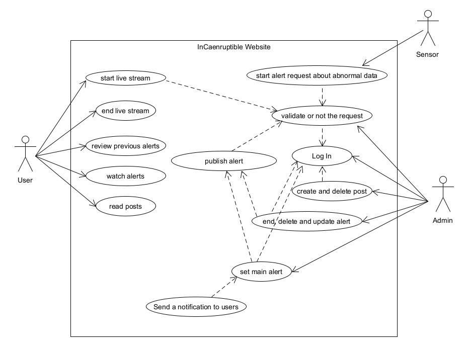

# Welcome to the InCaenruptibles' front office

### In order to **run** this project made with ReactJS, you need to do the following :

```shell
npm install
```

In order to install all the project's dependencies. And then :

```shell
npm start
```

Now, all you need to do is to click on this link in order to reach the website : http://intensif07.ecole.ensicaen.fr:8180/

### Warning

In order to be able to use all of this server's functionalities, it is necessary to have a SSL secured server and access the website through HTTPS protocol. Otherwise, video streams will be blocked by the browser and you won't be able to see this functionality.


### Use case diagram


